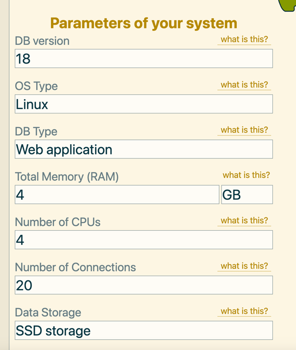

# hw4

1. Сделал [docker-compose файл](./docker-compose.yml) где запускаю контейнер с postgres 18.

2. Инициировал тестовую БД с данными (scale: 10)
```bash
pgbench -i -s 10 -h localhost -p 5432 -U postgres postgres 

select count(*) from pgbench_accounts;

  count  
---------
 1000000
(1 строка)
```

3. Выполняю первоначальный прогон pgbench. Конфигурация: 60 секунд, 20 клиентов, 4 потока.
```
docker exec -it postgres pgbench -c 20 -j 4 -T 60 -U postgres postgres

// результат:
transaction type: <builtin: TPC-B (sort of)>
scaling factor: 10
query mode: simple
number of clients: 20
number of threads: 4
maximum number of tries: 1
duration: 60 s
number of transactions actually processed: 741903
number of failed transactions: 0 (0.000%)
latency average = 1.617 ms
initial connection time = 20.837 ms
tps = 12365.591819 (without initial connection time)
```

4. Начинаем оптимизировать наш postges инстанс.
На лекции нам показали удобные инструменты, один из них https://pgtune.leopard.in.ua/
Вставил туда разрешенное количество ресурсов в докер контейнере где запущен postgres.


Рекомендуемые pgtune параметры (как сейчас -> рекомендуемое значение):
```
shared_buffers = 128MB -> 1GB
effective_cache_size = 4GB -> 3GB
maintenance_work_mem = 64MB -> 256MB
wal_buffers = 4MB -> 16MB
random_page_cost = 4 -> 1.1
effective_io_concurrency = 16 -> 200
work_mem = 4MB -> 43690kB
huge_pages = try -> off
jit = on -> off
wal_compression = off -> lz4
min_wal_size = 80MB -> 1GB
max_wal_size = 1GB -> 4GB
max_worker_processes = 8 -> 4
max_parallel_workers = 8 -> 4
```

Обновил каждый параметр через `ALTER SYSTEM SET` (изменения через эту инструкцию попадают в postgresql.auto.conf). Перезапускаю postgres чтобы изменения применились и сбросились кеши.

5. Запускаем тест pgbench повторно и получаем результат:
```
transaction type: <builtin: TPC-B (sort of)>
scaling factor: 10
query mode: simple
number of clients: 20
number of threads: 4
maximum number of tries: 1
duration: 60 s
number of transactions actually processed: 824437
number of failed transactions: 0 (0.000%)
latency average = 1.456 ms
initial connection time = 16.874 ms
tps = 13739.800294 (without initial connection time)
```

В целом видим что tps значительно вырос (с 12365 до 13739), а latency уменьшился (с 1.617 до 1.456).
Результат, как мне кажется, хороший и говорит о том что тюнить постгрес с дефолтных настроек нужно обязательно.

## Что повлияло на результат
Как мне кажется в первую очередь это увеличиние shared_buffers (128МБ до 1ГБ)- за счет этого постгрес стал больше работать с оперативной памятью, чем с диском.
Также немаловажную роль сыграло увеличение work_mem (с 4 МБ до ~43МБ) - это лимит памяти на одну операцию.
Еще полезным было увеличение effective_io_concurrency - так как у меня ssd, это подсказывает планировщику что можно одновременно выполнять больше IO операций.
В меньшей степени, но, как мне кажется, тоже повлияло выключение jit - как я понял это полезно больше для сложных аналитических запросов, но на небольшие запросы (коих в oltp большинство) может оказывать негативный эффект.
